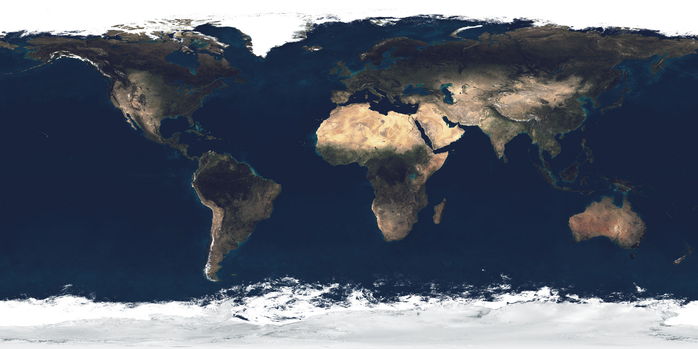

# Celestial Explorer

An interactive, real-time 3D model of the solar system that runs entirely in the
browser — no build step, no server, no dependencies to install. Pan, zoom, and fly
from the surface of the Sun out past the Oort cloud, search for any body by name, and
scrub through time to watch orbits, comet tails, and historic events unfold.

Built with [three.js](https://threejs.org/) and plain ES modules.



---

## Features

**The solar system, at true relative scale**
- The Sun, all eight planets, and Pluto, with real photographic surface maps
- Earth rendered with day/night sides, animated city lights, drifting clouds, and atmosphere
- Saturn, Uranus, Jupiter, and Neptune rings (including Neptune's bright Adams-ring arcs)

**31 moons.** Most are tidally locked, keeping one face toward their planet just like the real Moon — but not all: Saturn's **Hyperion**, the captured moon **Phoebe**, Neptune's **Nereid**, and Pluto's small moons (**Nix, Hydra, Kerberos, Styx**) tumble chaotically or rotate freely, as each body's info card explains:
- Earth (Moon) · Mars (Phobos, Deimos) · Jupiter (Io, Europa, Ganymede, Callisto)
- Saturn (Titan, Mimas, Enceladus, Tethys, Dione, Rhea, Iapetus, Hyperion, Phoebe, Janus, Epimetheus)
- Uranus (Miranda, Ariel, Umbriel, Titania, Oberon) · Neptune (Triton, Proteus, Nereid)
- Pluto (Charon, Nix, Hydra, Kerberos, Styx)

**Comets** — Halley, Encke, and Hale–Bopp, with distance-aware comas and anti-sunward tails.

**Minor planets** — major asteroids and dwarf planets on accurate Keplerian orbits:
- Main belt: **Ceres**, **Vesta**, **Pallas**, **Hygiea**
- Kuiper Belt & scattered disc: **Eris**, **Makemake**, **Haumea**, **Gonggong**, **Quaoar**, **Orcus**
- Asteroids carry irregular, cratered, bump-mapped surfaces; Haumea has its real spin-flattened ellipsoid shape; **Vesta and Ceres use real NASA Dawn imagery**.

**Particle fields** — the main asteroid belt, the Jupiter Trojans, the Kuiper Belt, and a spherical Oort cloud that only resolves once you pull far enough back.

**Beyond the solar system** — nearby stars, deep-sky objects, spacecraft, constellation
lines, and the Milky Way, all named and selectable.

**Tools**
- 🔍 **Search** any named body — planets, moons, comets, asteroids, stars, deep-sky objects (`/` or `Ctrl/Cmd-K` to focus, ↑/↓ to navigate, Enter to fly there)
- A **Bodies** menu, a **View** menu of toggleable layers, a guided **Tour**, and an **Events** timeline
- Time controls — play, pause, speed up, and scrub through dates

---

## Running it

It's fully static. Any of these work:

- **Just open it** — double-click `index.html`. (Some browsers restrict ES modules on
  the `file://` protocol; if it doesn't load, use one of the options below.)
- **Local web server** — from this folder:
  ```bash
  python3 -m http.server 8000
  # then visit http://localhost:8000
  ```
- **GitHub Pages** — see below.

---

## Deploying to GitHub Pages

1. Put `index.html`, the `js/` folder, and the `textures/` folder in the root of your repo.
2. In the repo, go to **Settings → Pages**.
3. Under **Source**, choose **Deploy from a branch**, select your `main` branch and the
   `/ (root)` folder, and **Save**.
4. Wait about a minute. Your site will be live at
   `https://<username>.github.io/<repo>/`.

> **Note:** GitHub Pages serves public repositories for free. To publish from a *private*
> repo you need a paid GitHub plan — otherwise set the repo to public.

---

## Credits & attribution

This project stands on data and imagery generously released to the public by the
astronomy and open-source communities.

### Software
- **[three.js](https://threejs.org/)** (r160) — WebGL rendering engine. © three.js
  authors, MIT License. A copy is bundled in `js/`.

### Imagery — Sun, planets & rings (Solar System Scope)
The surface maps for the **Sun, Mercury, Venus, Mars, Jupiter, Saturn, Uranus,
Neptune**, the **Moon**'s color map, and **Saturn's rings** come from the
**Solar System Scope** texture set (<https://www.solarsystemscope.com/textures/>),
which is built from **NASA** elevation and imagery data.

- `sun_color.jpg`, `mercury_color.jpg`, `venus_atmosphere.jpg`, `mars_color.jpg`,
  `jupiter_color.jpg`, `saturn_color.jpg`, `uranus_color.jpg`, `neptune_color.jpg`,
  `moon_color.jpg`, `saturn_ring.png`
- Credit: **Solar System Scope (solarsystemscope.com)**, licensed under
  **[CC BY 4.0](https://creativecommons.org/licenses/by/4.0/)**. Underlying data: NASA.
- The 8K source maps were downscaled to 4096 px for the Sun and inner planets; the
  ice giants and ring are used at their original 2K resolution.

### Imagery — real spacecraft data (NASA)
- **Moon elevation** (`textures/moon_height.jpg`) — the **LDEM** lunar topography
  from NASA's **CGI Moon Kit**, derived from the **Lunar Orbiter Laser Altimeter
  (LOLA)** aboard the Lunar Reconnaissance Orbiter. Used here as a bump/displacement
  map for crater relief. Credit: **NASA / Goddard Space Flight Center Scientific
  Visualization Studio**. Public domain.
- **Pluto** (`textures/pluto_color.jpg`) — a global color map assembled from NASA's
  **New Horizons** flyby imagery (LORRI / Ralph-MVIC), via James Hastings-Trew /
  Planet Pixel Emporium. Credit: **NASA / JHU-APL / SwRI**. Public domain.
- **Charon** (`textures/charon_color.jpg`) — reprojected for this project from the
  iconic **New Horizons** enhanced-color global portrait of Charon (image **PIA19968**).
  The full-disk photo was mathematically un-projected into an equirectangular map; the
  hemisphere New Horizons did not image is filled with neutral icy grey.
  Credit: **NASA / Johns Hopkins APL / SwRI**. Public domain.
- **Vesta** (`textures/vesta_color.jpg`) and **Ceres** (`textures/ceres_color.jpg`)
  — global mosaics from NASA's **Dawn** mission, Framing Camera.
  Credit: **NASA / JPL-Caltech / UCLA / MPS / DLR / IDA**, processed and distributed by
  the **USGS Astrogeology Science Center** (Map-a-Planet 2 / Astropedia). Public domain.

### Imagery — Earth
Earth's maps (`earth_atmos_2048.jpg`, `earth_clouds_1024.png`, `earth_lights_2048.png`)
are the **NASA Visible Earth / Blue Marble** maps as distributed with the three.js
examples (day color, cloud layer, and city-lights night map).
Credit: **NASA Earth Observatory**. Public domain.

> ℹ️ **Note on licensing.** NASA imagery is generally public domain. The Solar System
> Scope maps are **CC BY 4.0** — keep the attribution above if you redistribute them.
> Confirm terms before any commercial use.

### Orbital & ephemeris data
- Orbital elements, body radii, and rotation periods are based on published
  **NASA / JPL** values.
- The Artemis II Orion trajectory uses a real **NASA OEM ephemeris**.

### Procedural surfaces
Where no real map exists (Pallas, Hygiea, and other small bodies), the surfaces are
generated procedurally in `js/textures.js` — cratered albedo plus a matching bump map —
so the project needs no external assets for them.

---

## Project structure

```
index.html        — the entire app shell, styles, and boot supervisor
js/
  app.js          — scene setup, the per-frame loop, positioning, layer toggles
  ui.js           — labels, picking, info cards, search, time controls, tour
  data.js         — every body: orbital elements, radii, facts, tour, events
  bodies.js       — builds the Sun, planets, moons, comets, minor planets, rings, belts
  textures.js     — procedural texture & bump generators
  farfield.js     — nearby stars, deep-sky objects, spacecraft, galaxy
  sky.js          — constellation lines
  ephemeris.js    — Keplerian orbit solver
  artemis*.js     — Artemis II Orion trajectory
  bundle.js       — bundled three.js (r160)
  vendor/         — three.js add-ons (OrbitControls, post-processing passes)
textures/         — surface maps
```

---

## License

The application code in this repository is free to use and modify. Third-party
software (three.js) and imagery retain their own licenses and attributions — see
**Credits & attribution** above. Confirm the licensing of any base texture before
redistributing it commercially.
